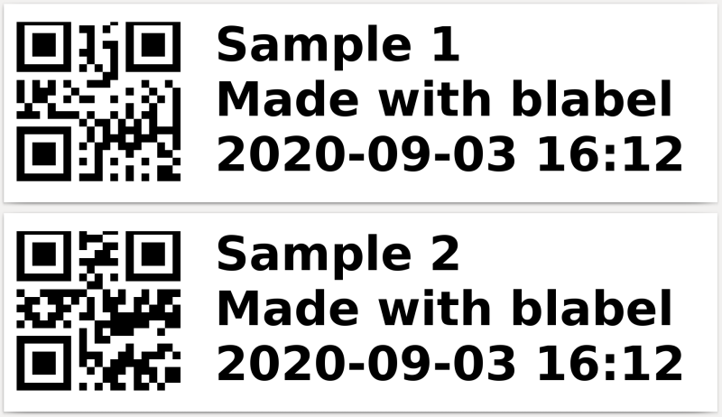

# QR-code and date

In this example we will print a QR code with a label indicating an auto-generated date.

<p align='center'></p>

This example shows:

- How to use ``label_tools.qr_code()``

## Run this example:
```
python3 fastener_label.py
```
